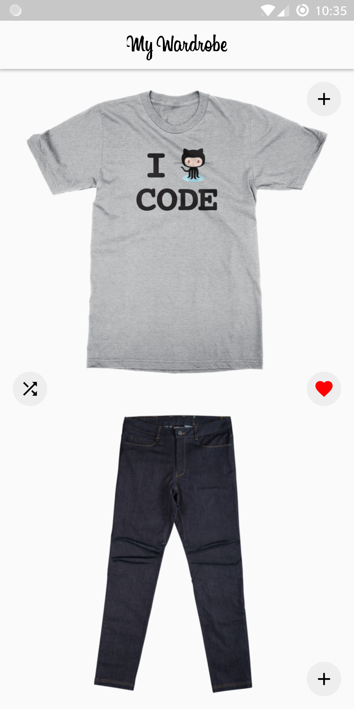
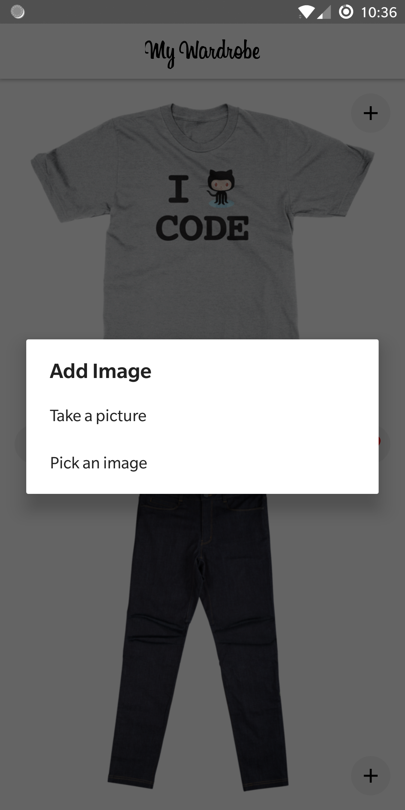
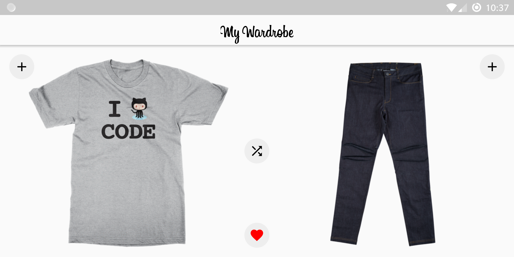

# My Wardrobe

An app that suggests you combinations of clothes for daily wear. 
The home screen is divided into two sections, each displaying a shirt (top) and a pair of trousers (bottoms). 
You can add more shirts or pants by clicking on the ‘+’ button on the right corner of each section. 
You can also swipe left and right each section if you don’t like the shirt or pants. 
In the centre, there's a 'shuffle’ button.

# Functionality

* Support for both camera and gallery to add shirts and pants

* You can swipe through both shirts and pants horizontally to see a new combination.

* Shuffle button to display a random combination of shirt and pants.

* Favorite button to mark a given combination as favorite.

# Screenshots

  
  
  

# Dependencies

* Support: AppCompat, Design, ConstraintLayout

* Database: Room

* Images: Glide

* Events: Greenrobot's EventBus
